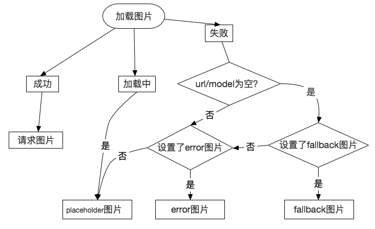

# 占位符

## 类型

Glide允许用户指定三种不同的占位符以是适应不同的场景：
- placeholder
- error
- fallback

### Placeholder

占位符是在请求正在进行时显示的图像。当请求成功完成时，占位符将会被替换为请求的资源。如果从内存中加载所请求的资源，占位符可能永远不会显示。如果请求失败并且未设置错误图像，则占位符会一直显示。同样地，如果请求的URL/Model为空，错误图像跟回调图像都没有设置，占位符也会一直显示。 

使用生成的API：
```
GlideApp.with(fragment)
  .load(url)
  .placeholder(R.drawable.placeholder)
  .into(view);
```

或者：

```
GlideApp.with(fragment)
  .load(url)
  .placeholder(new ColorDrawable(Color.BLACK))
  .into(view);
```

### Error
当请求最终失败的时，会显示错误图像。当请求的URL/Model为空，并且没有设置回调的时候，也会显示错误图像。

使用生成的API：
```
GlideApp.with(fragment)
  .load(url)
  .error(R.drawable.error)
  .into(view);
```

或者：

```
GlideApp.with(fragment)
  .load(url)
  .error(new ColorDrawable(Color.RED))
  .into(view);
```

### Fallback

当一个请求的URL/Model为空时，会显示回调图像。回调图像的主要目的是允许用户表明参数是否允许为空。例如，用户信息网站为空表明用户没有设置配置文件照片。然而，空也可以表明元数据是无效的或者无法获取。默认情况下，Glide认为URL/Model为空是一种错误，用户如果希望自己处理空，应该设置回调图像。

使用生成的API：
```
GlideApp.with(fragment)
  .load(url)
  .fallback(R.drawable.fallback)
  .into(view);
```

或者：

```
GlideApp.with(fragment)
  .load(url)
  .fallback(new ColorDrawable(Color.GREY))
  .into(view);
```

占位符的显示流程可以参照下图：


## 常见问题
1. 占位符是异步加载的吗？

答：不是。占位符的加载是在Android的主线程中处理的。我们希望占位符尽可能小并且容易被系统缓存。

2. 转换可以作为占位符吗？

答：不行。转换只适用于请求资源，不能作为占位符。比如，您加载一个圆形的图像，您可能希望使用圆形的占位符资源。您可以考虑自定义View来截取占位符作为您的转换。

3. 在多个View中可以使用同一个占位符图像吗？

答：通常可以，任何非静态的图像（如BitmapDrawable）是可以在多个View中显示的。然而有状态的图像在多个View中同时显示是不安全的，因为View的状态会被改变。对于有状态的图像，请使用资源id，或者使用**newDrawable()**传递给每个请求一个新的副本。